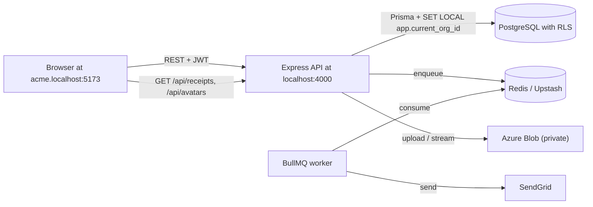

# Multi-Tenant SaaS Expense Tracker

A B2B expense app: each company uses its own subdomain (`acme.localhost`),
with **PostgreSQL Row-Level Security** so tenant data stays isolated. The API
sets `app.current_org_id` per request; **JWT** ties users to an org and role.
**React + shadcn** powers the UI (expenses, analytics, team, settings); **Azure
Blob** holds private receipts and profile avatars, streamed only through
authenticated API routes.

## Features (high level)

- **Expenses**: submit with optional receipt, categories, manager/admin
  approval or rejection, CSV export, delete (submitter notified).
- **Roles**: `ADMIN`, `MANAGER`, `EMPLOYEE` — admins manage invites and org
  settings; managers approve; employees submit and see a **read-only Team**
  view (members only).
- **Team**: invite by email, revoke invites; notifications when someone joins,
  an invite is accepted/revoked, or a new member appears (with links to the
  expense or **Team** page where relevant).
- **Admin governance**: transfer primary admin or request admin access;
  pending requests surface in **Settings** for admins.
- **In-app notifications**: persisted in Postgres, bell in the top bar, mark
  read; complements **BullMQ** + **SendGrid** for outbound email (optional in
  dev via `EMAIL_DRY_RUN`).
- **Profile**: name and optional avatar (upload/remove; initials fallback when
  none).

## Stack

- **Frontend**: React 19 (Vite, JavaScript), TailwindCSS v4, shadcn/ui,
  TanStack Query, React Router, react-hook-form + zod, Recharts, sonner,
  zustand.
- **Backend**: Node.js + Express 5, Prisma 7 + PostgreSQL with RLS, JWT
  authentication, BullMQ + ioredis (Upstash compatible), SendGrid, Multer,
  `@azure/storage-blob`, csv-stringify.



## Repository layout

```
backend/    Express API + Prisma + BullMQ email worker
frontend/   Vite + React + shadcn UI
```

## Prerequisites

- Node 20+
- PostgreSQL 14+ running locally (or accessible URL)
- Redis (local or Upstash)
- Optional: Azure Storage account + container for real receipt uploads
- Optional: SendGrid account + verified sender (otherwise emails are
  printed to the API/worker stdout in `EMAIL_DRY_RUN=true` mode)

## One-time local setup

### 1. Hosts file (Windows)

To make `*.localhost` resolvable, modern browsers already treat `*.localhost`
as `127.0.0.1`. On Windows you don't need to edit `hosts` for that. If you
want explicit entries (for `nslookup` etc.), add to
`C:\Windows\System32\drivers\etc\hosts`:

```
127.0.0.1 app.localhost
127.0.0.1 acme.localhost
127.0.0.1 globex.localhost
```

### 2. Postgres roles + database

Create the database and the two roles used by the app:

```bash
createdb expense_tracker
psql -d expense_tracker -f backend/prisma/sql/roles.sql
```

`app_owner` is used by `prisma migrate` and the very first signup-org call
(it has `BYPASSRLS` so it can insert across orgs). `app_user` is used by the
running API and is subject to RLS policies — these are the policies that
make multi-tenancy bulletproof.

### 3. Backend

```bash
cd backend
cp .env.example .env
# Edit DATABASE_URL / MIGRATE_DATABASE_URL passwords if you changed them in
# roles.sql, then:
npm install
npm run prisma:migrate -- --name init   # create tables
npm run db:apply-rls                     # enable RLS + create policies
npm run db:seed                          # seed two demo orgs (acme + globex)
```

The seed script prints demo logins. Default password is `password123`.

### 4. Frontend

```bash
cd frontend
cp .env.example .env
npm install
```

## Run locally

You need three processes:

```bash
# 1. API
cd backend && npm run dev

# 2. Email worker (BullMQ)
cd backend && npm run dev:worker

# 3. Frontend
cd frontend && npm run dev
```

Then visit:

- `http://app.localhost:5173/`           — Landing / org signup
- `http://acme.localhost:5173/login`     — Acme tenant login
- `http://globex.localhost:5173/login`   — Globex tenant login

Demo accounts (seeded by `npm run db:seed`):

| Org    | Email               | Role     |
| ------ | ------------------- | -------- |
| Acme   | alice@acme.test     | ADMIN    |
| Acme   | mark@acme.test      | MANAGER  |
| Acme   | eve@acme.test       | EMPLOYEE |
| Globex | greg@globex.test    | ADMIN    |
| Globex | mia@globex.test     | MANAGER  |
| Globex | ed@globex.test      | EMPLOYEE |

Password for all: `password123`.

## How multi-tenancy works

1. Each tenant-scoped table (`User`, `Invite`, `Expense`, `Approval`,
   `Notification`, `AdminRequest`, and others) carries `orgId` and has RLS
   enabled with a policy that
   compares against `current_setting('app.current_org_id')`.
2. The runtime API connects to Postgres as `app_user`, a non-`BYPASSRLS`
   role. It cannot see any rows unless the GUC is set.
3. On each request, middleware:
    - resolves the tenant by hostname (e.g. `acme.localhost` →
      `Organization.slug = 'acme'`),
    - verifies the JWT,
    - rejects mismatches between JWT `orgId` and the host's org,
    - enters an `AsyncLocalStorage` context with the orgId.
4. A Prisma client extension wraps every model query in a transaction that
   first executes `SET LOCAL app.current_org_id = '<uuid>'`. RLS does the
   rest.
5. Raw SQL queries (analytics aggregates) use the same pattern via
   `runInTenantTx`.

The signup-org endpoint is the only path that legitimately writes across
tenants — it uses a separate `adminPrisma` client connected as `app_owner`.

## Azure Blob & SendGrid

**Blob**: receipts and avatars live in a **private** container. The API returns
paths like `/api/receipts/:orgId/:file` and `/api/avatars/:orgId/:file`; the
browser never talks to Azure directly. Configure `AZURE_STORAGE_CONNECTION_STRING`
and `AZURE_BLOB_CONTAINER` (see `backend/.env.example`). Without blob config,
receipt upload returns **503**; expenses without a receipt still work.

**Email**: set `SENDGRID_API_KEY` and sender fields. If unset, the app defaults
to `EMAIL_DRY_RUN=true` (log to stdout, no SendGrid). The **worker process**
must run with a reachable `REDIS_URL` or jobs will not be processed.

## Production deployment outline

- Backend API + Worker → Render or similar, two services sharing the repo
  (different start commands), Postgres on Render, Redis on Upstash.
- Frontend → Vercel with wildcard domain `*.your-app.com`.
- Set `VITE_API_URL` to the deployed API host.
- Tighten `CORS_ORIGIN_REGEX` and `RESERVED_SUBDOMAINS` for production.

## Useful npm scripts

Backend:

- `npm run dev`             API in watch mode
- `npm run dev:worker`      BullMQ worker in watch mode
- `npm run prisma:migrate`  Run migrations (uses `MIGRATE_DATABASE_URL`)
- `npm run db:apply-rls`    Re-apply RLS policies (idempotent)
- `npm run db:seed`         Seed two demo orgs
- `npm run db:setup`        Migrate + apply RLS + seed in one go
- `npm run prisma:studio`   GUI explorer

Frontend:

- `npm run dev`     Vite dev server (binds `*.localhost`)
- `npm run build`   Production build
- `npm run preview` Preview the build
